# Projects and dependencies analysis

This document provides a comprehensive overview of the projects and their dependencies in the context of upgrading to .NETCoreApp,Version=v10.0.

## Table of Contents

- [Executive Summary](#executive-Summary)
  - [Highlevel Metrics](#highlevel-metrics)
  - [Projects Compatibility](#projects-compatibility)
  - [Package Compatibility](#package-compatibility)
  - [API Compatibility](#api-compatibility)
- [Aggregate NuGet packages details](#aggregate-nuget-packages-details)
- [Top API Migration Challenges](#top-api-migration-challenges)
  - [Technologies and Features](#technologies-and-features)
  - [Most Frequent API Issues](#most-frequent-api-issues)
- [Projects Relationship Graph](#projects-relationship-graph)
- [Project Details](#project-details)

  - [Greenshot.Base\Greenshot.Base.csproj](#greenshotbasegreenshotbasecsproj)
  - [Greenshot.BuildTasks\Greenshot.BuildTasks.csproj](#greenshotbuildtasksgreenshotbuildtaskscsproj)
  - [Greenshot.Editor\Greenshot.Editor.csproj](#greenshoteditorgreenshoteditorcsproj)
  - [Greenshot.Plugin.Box\Greenshot.Plugin.Box.csproj](#greenshotpluginboxgreenshotpluginboxcsproj)
  - [Greenshot.Plugin.Confluence\Greenshot.Plugin.Confluence.csproj](#greenshotpluginconfluencegreenshotpluginconfluencecsproj)
  - [Greenshot.Plugin.Dropbox\Greenshot.Plugin.Dropbox.csproj](#greenshotplugindropboxgreenshotplugindropboxcsproj)
  - [Greenshot.Plugin.ExternalCommand\Greenshot.Plugin.ExternalCommand.csproj](#greenshotpluginexternalcommandgreenshotpluginexternalcommandcsproj)
  - [Greenshot.Plugin.Imgur\Greenshot.Plugin.Imgur.csproj](#greenshotpluginimgurgreenshotpluginimgurcsproj)
  - [Greenshot.Plugin.Jira\Greenshot.Plugin.Jira.csproj](#greenshotpluginjiragreenshotpluginjiracsproj)
  - [Greenshot.Plugin.Office\Greenshot.Plugin.Office.csproj](#greenshotpluginofficegreenshotpluginofficecsproj)
  - [Greenshot.Test\Greenshot.Test.csproj](#greenshottestgreenshottestcsproj)
  - [Greenshot\Greenshot.csproj](#greenshotgreenshotcsproj)

## Executive Summary

### Highlevel Metrics

| Metric | Count | Status |
| :--- | :---: | :--- |
| Total Projects | 12 | All require upgrade |
| Total NuGet Packages | 36 | 4 need upgrade |
| Total Code Files | 596 |  |
| Total Code Files with Incidents | 321 |  |
| Total Lines of Code | 94948 |  |
| Total Number of Issues | 19055 |  |
| Estimated LOC to modify | 19039+ | at least 20,1% of codebase |

### Projects Compatibility

| Project | Target Framework | Difficulty | Package Issues | API Issues | Est. LOC Impact | Description |
| :--- | :---: | :---: | :---: | :---: | :---: | :--- |
| [Greenshot.Base\Greenshot.Base.csproj](#greenshotbasegreenshotbasecsproj) | net480 | 🟡 Medium | 0 | 3216 | 3216+ | Wpf, Sdk Style = True |
| [Greenshot.BuildTasks\Greenshot.BuildTasks.csproj](#greenshotbuildtasksgreenshotbuildtaskscsproj) | net480 | 🟢 Low | 0 | 1 | 1+ | Wpf, Sdk Style = True |
| [Greenshot.Editor\Greenshot.Editor.csproj](#greenshoteditorgreenshoteditorcsproj) | net480 | 🟡 Medium | 1 | 8465 | 8465+ | Wpf, Sdk Style = True |
| [Greenshot.Plugin.Box\Greenshot.Plugin.Box.csproj](#greenshotpluginboxgreenshotpluginboxcsproj) | net480 | 🟡 Medium | 0 | 156 | 156+ | Wpf, Sdk Style = True |
| [Greenshot.Plugin.Confluence\Greenshot.Plugin.Confluence.csproj](#greenshotpluginconfluencegreenshotpluginconfluencecsproj) | net480 | 🟡 Medium | 0 | 374 | 374+ | Wpf, Sdk Style = True |
| [Greenshot.Plugin.Dropbox\Greenshot.Plugin.Dropbox.csproj](#greenshotplugindropboxgreenshotplugindropboxcsproj) | net480 | 🟡 Medium | 0 | 140 | 140+ | Wpf, Sdk Style = True |
| [Greenshot.Plugin.ExternalCommand\Greenshot.Plugin.ExternalCommand.csproj](#greenshotpluginexternalcommandgreenshotpluginexternalcommandcsproj) | net480 | 🟡 Medium | 0 | 507 | 507+ | Wpf, Sdk Style = True |
| [Greenshot.Plugin.Imgur\Greenshot.Plugin.Imgur.csproj](#greenshotpluginimgurgreenshotpluginimgurcsproj) | net480 | 🟡 Medium | 0 | 647 | 647+ | Wpf, Sdk Style = True |
| [Greenshot.Plugin.Jira\Greenshot.Plugin.Jira.csproj](#greenshotpluginjiragreenshotpluginjiracsproj) | net480 | 🟡 Medium | 1 | 772 | 772+ | Wpf, Sdk Style = True |
| [Greenshot.Plugin.Office\Greenshot.Plugin.Office.csproj](#greenshotpluginofficegreenshotpluginofficecsproj) | net480 | 🟢 Low | 2 | 37 | 37+ | Wpf, Sdk Style = True |
| [Greenshot.Test\Greenshot.Test.csproj](#greenshottestgreenshottestcsproj) | net481 | 🟢 Low | 0 | 448 | 448+ | Wpf, Sdk Style = True |
| [Greenshot\Greenshot.csproj](#greenshotgreenshotcsproj) | net480 | 🟡 Medium | 0 | 4276 | 4276+ | Wpf, Sdk Style = True |

### Package Compatibility

| Status | Count | Percentage |
| :--- | :---: | :---: |
| ✅ Compatible | 32 | 88,9% |
| ⚠️ Incompatible | 3 | 8,3% |
| 🔄 Upgrade Recommended | 1 | 2,8% |
| ***Total NuGet Packages*** | ***36*** | ***100%*** |

### API Compatibility

| Category | Count | Impact |
| :--- | :---: | :--- |
| 🔴 Binary Incompatible | 13851 | High - Require code changes |
| 🟡 Source Incompatible | 5086 | Medium - Needs re-compilation and potential conflicting API error fixing |
| 🔵 Behavioral change | 102 | Low - Behavioral changes that may require testing at runtime |
| ✅ Compatible | 63542 |  |
| ***Total APIs Analyzed*** | ***82581*** |  |

## Aggregate NuGet packages details

| Package | Current Version | Suggested Version | Projects | Description |
| :--- | :---: | :---: | :--- | :--- |
| Dapplo.Confluence | 1.0.41 |  | [Greenshot.Plugin.Confluence.csproj](#greenshotpluginconfluencegreenshotpluginconfluencecsproj) | ✅Compatible |
| Dapplo.HttpExtensions.JsonNet | 2.0.11 |  | [Greenshot.Base.csproj](#greenshotbasegreenshotbasecsproj) | ✅Compatible |
| Dapplo.HttpExtensions.WinForms | 2.0.11 |  | [Greenshot.Plugin.Jira.csproj](#greenshotpluginjiragreenshotpluginjiracsproj) | ✅Compatible |
| Dapplo.Jira | 2.0.7 |  | [Greenshot.Plugin.Jira.csproj](#greenshotpluginjiragreenshotpluginjiracsproj) | ✅Compatible |
| Dapplo.Jira.SvgWinForms | 2.0.7 | 1.1.47 | [Greenshot.Plugin.Jira.csproj](#greenshotpluginjiragreenshotpluginjiracsproj) | ⚠️NuGet package is incompatible |
| Dapplo.Windows.Clipboard | 2.0.63 |  | [Greenshot.Base.csproj](#greenshotbasegreenshotbasecsproj) | ✅Compatible |
| Dapplo.Windows.Dpi | 2.0.63 |  | [Greenshot.Base.csproj](#greenshotbasegreenshotbasecsproj) | ✅Compatible |
| Dapplo.Windows.Gdi32 | 2.0.63 |  | [Greenshot.Base.csproj](#greenshotbasegreenshotbasecsproj) | ✅Compatible |
| Dapplo.Windows.Icons | 2.0.63 |  | [Greenshot.Base.csproj](#greenshotbasegreenshotbasecsproj) | ✅Compatible |
| Dapplo.Windows.Kernel32 | 2.0.63 |  | [Greenshot.Base.csproj](#greenshotbasegreenshotbasecsproj) | ✅Compatible |
| Dapplo.Windows.Multimedia | 2.0.63 |  | [Greenshot.Base.csproj](#greenshotbasegreenshotbasecsproj) | ✅Compatible |
| HtmlAgilityPack | 1.12.4 |  | [Greenshot.Base.csproj](#greenshotbasegreenshotbasecsproj) | ✅Compatible |
| Interop.Microsoft.Office.Interop.OneNote | 1.1.0.2 |  | [Greenshot.Plugin.Office.csproj](#greenshotpluginofficegreenshotpluginofficecsproj) | ✅Compatible |
| log4net | 3.3.0 |  | [Greenshot.Base.csproj](#greenshotbasegreenshotbasecsproj) | ✅Compatible |
| Microsoft.Build.Utilities.Core | 18.3.3 |  | [Greenshot.BuildTasks.csproj](#greenshotbuildtasksgreenshotbuildtaskscsproj) [Greenshot.csproj](#greenshotgreenshotcsproj) | ✅Compatible |
| Microsoft.IO.RecyclableMemoryStream | 3.0.1 |  | [Greenshot.Base.csproj](#greenshotbasegreenshotbasecsproj) | ✅Compatible |
| Microsoft.Office.Interop.Excel | 15.0.4795.1001 |  | [Greenshot.Plugin.Office.csproj](#greenshotpluginofficegreenshotpluginofficecsproj) | ✅Compatible |
| Microsoft.Office.Interop.Outlook | 15.0.4797.1004 |  | [Greenshot.Plugin.Office.csproj](#greenshotpluginofficegreenshotpluginofficecsproj) | ✅Compatible |
| Microsoft.Office.Interop.PowerPoint | 15.0.4420.1018 |  | [Greenshot.Plugin.Office.csproj](#greenshotpluginofficegreenshotpluginofficecsproj) | ✅Compatible |
| Microsoft.Office.Interop.Word | 15.0.4797.1004 |  | [Greenshot.Plugin.Office.csproj](#greenshotpluginofficegreenshotpluginofficecsproj) | ✅Compatible |
| Microsoft.SourceLink.GitHub | 10.0.103 |  | [Greenshot.Base.csproj](#greenshotbasegreenshotbasecsproj) [Greenshot.BuildTasks.csproj](#greenshotbuildtasksgreenshotbuildtaskscsproj) [Greenshot.csproj](#greenshotgreenshotcsproj) [Greenshot.Editor.csproj](#greenshoteditorgreenshoteditorcsproj) [Greenshot.Plugin.Box.csproj](#greenshotpluginboxgreenshotpluginboxcsproj) [Greenshot.Plugin.Confluence.csproj](#greenshotpluginconfluencegreenshotpluginconfluencecsproj) [Greenshot.Plugin.Dropbox.csproj](#greenshotplugindropboxgreenshotplugindropboxcsproj) [Greenshot.Plugin.ExternalCommand.csproj](#greenshotpluginexternalcommandgreenshotpluginexternalcommandcsproj) [Greenshot.Plugin.Imgur.csproj](#greenshotpluginimgurgreenshotpluginimgurcsproj) [Greenshot.Plugin.Jira.csproj](#greenshotpluginjiragreenshotpluginjiracsproj) [Greenshot.Plugin.Office.csproj](#greenshotpluginofficegreenshotpluginofficecsproj) [Greenshot.Test.csproj](#greenshottestgreenshottestcsproj) | ✅Compatible |
| Microsoft.Toolkit.Uwp.Notifications | 7.1.3 |  | [Greenshot.csproj](#greenshotgreenshotcsproj) | ✅Compatible |
| MicrosoftOfficeCore | 15.0.0 |  | [Greenshot.Plugin.Office.csproj](#greenshotpluginofficegreenshotpluginofficecsproj) | ⚠️NuGet package is incompatible |
| MSBuildTasks | 1.5.0.235 |  | [Greenshot.Base.csproj](#greenshotbasegreenshotbasecsproj) [Greenshot.BuildTasks.csproj](#greenshotbuildtasksgreenshotbuildtaskscsproj) [Greenshot.csproj](#greenshotgreenshotcsproj) [Greenshot.Editor.csproj](#greenshoteditorgreenshoteditorcsproj) [Greenshot.Plugin.Box.csproj](#greenshotpluginboxgreenshotpluginboxcsproj) [Greenshot.Plugin.Confluence.csproj](#greenshotpluginconfluencegreenshotpluginconfluencecsproj) [Greenshot.Plugin.Dropbox.csproj](#greenshotplugindropboxgreenshotplugindropboxcsproj) [Greenshot.Plugin.ExternalCommand.csproj](#greenshotpluginexternalcommandgreenshotpluginexternalcommandcsproj) [Greenshot.Plugin.Imgur.csproj](#greenshotpluginimgurgreenshotpluginimgurcsproj) [Greenshot.Plugin.Jira.csproj](#greenshotpluginjiragreenshotpluginjiracsproj) [Greenshot.Plugin.Office.csproj](#greenshotpluginofficegreenshotpluginofficecsproj) [Greenshot.Test.csproj](#greenshottestgreenshottestcsproj) | ✅Compatible |
| Nerdbank.GitVersioning | 3.9.50 |  | [Greenshot.Base.csproj](#greenshotbasegreenshotbasecsproj) [Greenshot.BuildTasks.csproj](#greenshotbuildtasksgreenshotbuildtaskscsproj) [Greenshot.csproj](#greenshotgreenshotcsproj) [Greenshot.Editor.csproj](#greenshoteditorgreenshoteditorcsproj) [Greenshot.Plugin.Box.csproj](#greenshotpluginboxgreenshotpluginboxcsproj) [Greenshot.Plugin.Confluence.csproj](#greenshotpluginconfluencegreenshotpluginconfluencecsproj) [Greenshot.Plugin.Dropbox.csproj](#greenshotplugindropboxgreenshotplugindropboxcsproj) [Greenshot.Plugin.ExternalCommand.csproj](#greenshotpluginexternalcommandgreenshotpluginexternalcommandcsproj) [Greenshot.Plugin.Imgur.csproj](#greenshotpluginimgurgreenshotpluginimgurcsproj) [Greenshot.Plugin.Jira.csproj](#greenshotpluginjiragreenshotpluginjiracsproj) [Greenshot.Plugin.Office.csproj](#greenshotpluginofficegreenshotpluginofficecsproj) [Greenshot.Test.csproj](#greenshottestgreenshottestcsproj) | ✅Compatible |
| SixLabors.ImageSharp | 2.1.13 |  | [Greenshot.Base.csproj](#greenshotbasegreenshotbasecsproj) [Greenshot.BuildTasks.csproj](#greenshotbuildtasksgreenshotbuildtaskscsproj) [Greenshot.csproj](#greenshotgreenshotcsproj) [Greenshot.Editor.csproj](#greenshoteditorgreenshoteditorcsproj) | ✅Compatible |
| SixLabors.ImageSharp.Drawing | 1.0.0 |  | [Greenshot.BuildTasks.csproj](#greenshotbuildtasksgreenshotbuildtaskscsproj) [Greenshot.Editor.csproj](#greenshoteditorgreenshoteditorcsproj) | ✅Compatible |
| Svg | 3.4.7 |  | [Greenshot.Base.csproj](#greenshotbasegreenshotbasecsproj) | ✅Compatible |
| System.CommandLine | 3.0.0-preview.1.26104.118 |  | [Greenshot.csproj](#greenshotgreenshotcsproj) | ✅Compatible |
| System.Reactive.Linq | 6.1.0 |  | [Greenshot.Editor.csproj](#greenshoteditorgreenshoteditorcsproj) | ✅Compatible |
| System.Text.Json | 10.0.2 | 10.0.5 | [Greenshot.Editor.csproj](#greenshoteditorgreenshoteditorcsproj) | NuGet package upgrade is recommended |
| System.Text.Json | 10.0.5 |  | [Greenshot.csproj](#greenshotgreenshotcsproj) | ✅Compatible |
| Tools.InnoSetup | 6.7.1 |  | [Greenshot.csproj](#greenshotgreenshotcsproj) | ✅Compatible |
| Unofficial.Microsoft.mshtml | 7.0.3300 |  | [Greenshot.Plugin.Office.csproj](#greenshotpluginofficegreenshotpluginofficecsproj) | ⚠️NuGet package is incompatible |
| xunit | 2.4.2 |  | [Greenshot.Test.csproj](#greenshottestgreenshottestcsproj) | ✅Compatible |
| xunit.runner.visualstudio | 2.4.5 |  | [Greenshot.Test.csproj](#greenshottestgreenshottestcsproj) | ✅Compatible |

## Top API Migration Challenges

### Technologies and Features

| Technology | Issues | Percentage | Migration Path |
| :--- | :---: | :---: | :--- |
| Windows Forms | 13272 | 69,7% | Windows Forms APIs for building Windows desktop applications with traditional Forms-based UI that are available in .NET on Windows. Enable Windows Desktop support: Option 1 (Recommended): Target net9.0-windows; Option 2: Add <UseWindowsDesktop>true</UseWindowsDesktop>; Option 3 (Legacy): Use Microsoft.NET.Sdk.WindowsDesktop SDK. |
| GDI+ / System.Drawing | 4954 | 26,0% | System.Drawing APIs for 2D graphics, imaging, and printing that are available via NuGet package System.Drawing.Common. Note: Not recommended for server scenarios due to Windows dependencies; consider cross-platform alternatives like SkiaSharp or ImageSharp for new code. |
| WPF (Windows Presentation Foundation) | 337 | 1,8% | WPF APIs for building Windows desktop applications with XAML-based UI that are available in .NET on Windows. WPF provides rich desktop UI capabilities with data binding and styling. Enable Windows Desktop support: Option 1 (Recommended): Target net9.0-windows; Option 2: Add <UseWindowsDesktop>true</UseWindowsDesktop>. |
| Deprecated Remoting & Serialization | 42 | 0,2% | Legacy .NET Remoting, BinaryFormatter, and related serialization APIs that are deprecated and removed for security reasons. Remoting provided distributed object communication but had significant security vulnerabilities. Migrate to gRPC, HTTP APIs, or modern serialization (System.Text.Json, protobuf). |
| Windows Forms Legacy Controls | 7 | 0,0% | Legacy Windows Forms controls that have been removed from .NET Core/5+ including StatusBar, DataGrid, ContextMenu, MainMenu, MenuItem, and ToolBar. These controls were replaced by more modern alternatives. Use ToolStrip, MenuStrip, ContextMenuStrip, and DataGridView instead. |
| COM Interop Changes | 4 | 0,0% | COM-specific APIs that have changes or removals in .NET Core/.NET due to cross-platform considerations. Some COM interop functionality requires Windows-specific features. Review COM interop requirements; some APIs require Windows Compatibility Pack. |
| Legacy Cryptography | 2 | 0,0% | Obsolete or insecure cryptographic algorithms that have been deprecated for security reasons. These algorithms are no longer considered secure by modern standards. Migrate to modern cryptographic APIs using secure algorithms. |
| Code Access Security (CAS) | 2 | 0,0% | Code Access Security (CAS) APIs that were removed in .NET Core/.NET for security and performance reasons. CAS provided fine-grained security policies but proved complex and ineffective. Remove CAS usage; not supported in modern .NET. |
| Windows Access Control Lists (ACLs) | 1 | 0,0% | Windows Access Control List (ACL) APIs for file, directory, and synchronization object security that have moved to extension methods or different types. While .NET Core supports Windows ACLs, the APIs have been reorganized. Use System.IO.FileSystem.AccessControl and similar packages for ACL functionality. |

### Most Frequent API Issues

| API | Count | Percentage | Category |
| :--- | :---: | :---: | :--- |
| T:System.Drawing.Image | 782 | 4,1% | Source Incompatible |
| T:System.Windows.Forms.Keys | 750 | 3,9% | Binary Incompatible |
| P:System.Windows.Forms.Control.Name | 351 | 1,8% | Binary Incompatible |
| T:System.Drawing.Bitmap | 346 | 1,8% | Source Incompatible |
| T:System.Windows.Forms.TextBox | 343 | 1,8% | Binary Incompatible |
| T:System.Windows.Forms.NumericUpDown | 333 | 1,7% | Binary Incompatible |
| P:System.Windows.Forms.Control.Size | 319 | 1,7% | Binary Incompatible |
| T:System.Windows.Forms.Control.ControlCollection | 318 | 1,7% | Binary Incompatible |
| P:System.Windows.Forms.Control.Controls | 314 | 1,6% | Binary Incompatible |
| M:System.Windows.Forms.Control.ControlCollection.Add(System.Windows.Forms.Control) | 310 | 1,6% | Binary Incompatible |
| T:System.Windows.Forms.DialogResult | 309 | 1,6% | Binary Incompatible |
| P:System.Windows.Forms.Control.Location | 306 | 1,6% | Binary Incompatible |
| P:System.Windows.Forms.Control.TabIndex | 303 | 1,6% | Binary Incompatible |
| T:System.Drawing.ContentAlignment | 235 | 1,2% | Source Incompatible |
| T:System.Windows.Forms.ToolStripMenuItem | 224 | 1,2% | Binary Incompatible |
| T:System.Windows.Forms.AnchorStyles | 220 | 1,2% | Binary Incompatible |
| T:System.Drawing.Imaging.PixelFormat | 216 | 1,1% | Source Incompatible |
| T:System.Windows.Forms.Label | 215 | 1,1% | Binary Incompatible |
| T:System.Windows.Forms.Button | 202 | 1,1% | Binary Incompatible |
| T:System.Windows.Forms.ListView | 188 | 1,0% | Binary Incompatible |
| P:System.Windows.Forms.ToolStripItem.Name | 187 | 1,0% | Binary Incompatible |
| T:System.Windows.Forms.ComboBox | 177 | 0,9% | Binary Incompatible |
| T:System.Windows.Forms.Panel | 158 | 0,8% | Binary Incompatible |
| T:System.Windows.Forms.ToolStripItemDisplayStyle | 156 | 0,8% | Binary Incompatible |
| T:System.Windows.Forms.ToolStripSeparator | 153 | 0,8% | Binary Incompatible |
| T:System.Drawing.StringAlignment | 149 | 0,8% | Source Incompatible |
| T:System.Drawing.Graphics | 125 | 0,7% | Source Incompatible |
| E:System.Windows.Forms.ToolStripItem.Click | 124 | 0,7% | Binary Incompatible |
| P:System.Drawing.Image.Height | 116 | 0,6% | Source Incompatible |
| P:System.Windows.Forms.ToolStripItem.Image | 116 | 0,6% | Binary Incompatible |
| P:System.Drawing.Image.Width | 114 | 0,6% | Source Incompatible |
| P:System.Windows.Forms.ButtonBase.UseVisualStyleBackColor | 105 | 0,6% | Binary Incompatible |
| P:System.Windows.Forms.TextBox.Text | 93 | 0,5% | Binary Incompatible |
| T:System.Drawing.Icon | 87 | 0,5% | Source Incompatible |
| M:System.Windows.Forms.Control.SuspendLayout | 86 | 0,5% | Binary Incompatible |
| P:System.Windows.Forms.Control.Enabled | 86 | 0,5% | Binary Incompatible |
| T:System.Drawing.Drawing2D.Matrix | 85 | 0,4% | Source Incompatible |
| T:System.Windows.Forms.ToolStripItemCollection | 83 | 0,4% | Binary Incompatible |
| T:System.Windows.Forms.LinkLabel | 82 | 0,4% | Binary Incompatible |
| T:System.Windows.Forms.AutoScaleMode | 81 | 0,4% | Binary Incompatible |
| T:System.Windows.Forms.Cursor | 78 | 0,4% | Binary Incompatible |
| T:System.Drawing.Drawing2D.InterpolationMode | 78 | 0,4% | Source Incompatible |
| T:System.Drawing.Drawing2D.SmoothingMode | 78 | 0,4% | Source Incompatible |
| M:System.Windows.Forms.Control.ResumeLayout(System.Boolean) | 75 | 0,4% | Binary Incompatible |
| T:System.Drawing.Drawing2D.PixelOffsetMode | 75 | 0,4% | Source Incompatible |
| T:System.Windows.Forms.TrackBar | 73 | 0,4% | Binary Incompatible |
| T:System.Windows.Forms.FormBorderStyle | 72 | 0,4% | Binary Incompatible |
| T:System.Drawing.FontStyle | 72 | 0,4% | Source Incompatible |
| P:System.Drawing.Image.Size | 71 | 0,4% | Source Incompatible |
| T:System.Drawing.GraphicsUnit | 70 | 0,4% | Source Incompatible |

## Projects Relationship Graph

Legend:
📦 SDK-style project
⚙️ Classic project

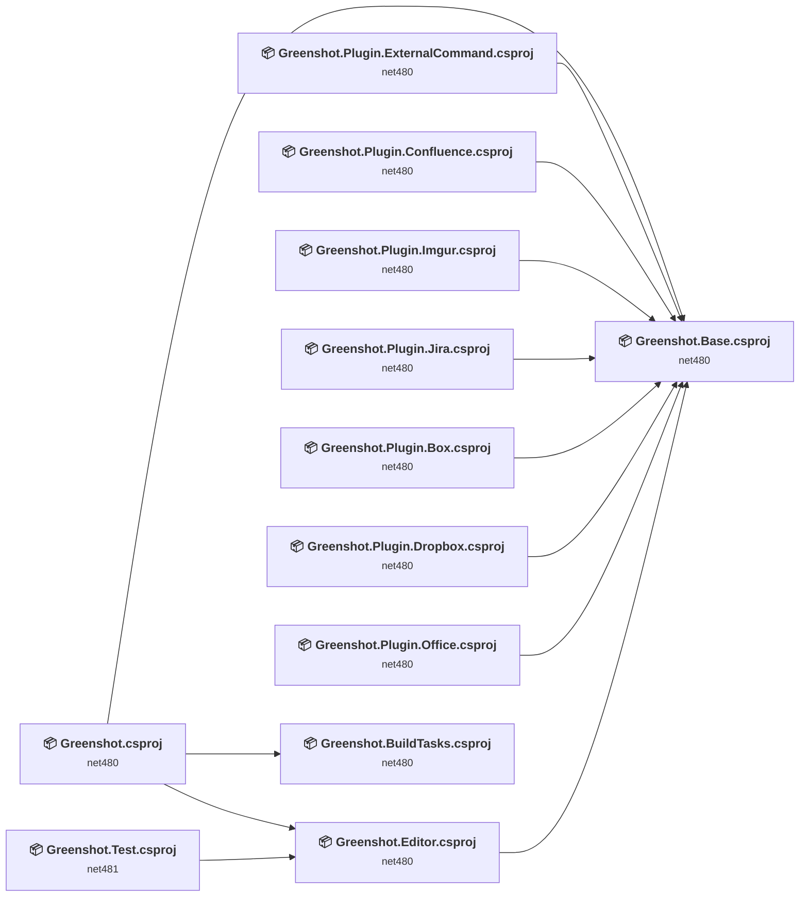

## Project Details

### Greenshot.Base\Greenshot.Base.csproj

#### Project Info

- **Current Target Framework:** net480
- **Proposed Target Framework:** net10.0-windows
- **SDK-style**: True
- **Project Kind:** Wpf
- **Dependencies**: 0
- **Dependants**: 9
- **Number of Files**: 181
- **Number of Files with Incidents**: 88
- **Lines of Code**: 29211
- **Estimated LOC to modify**: 3216+ (at least 11,0% of the project)

#### Dependency Graph

Legend:
📦 SDK-style project
⚙️ Classic project

```mermaid
flowchart TB
    subgraph upstream["Dependants (9)"]
        P1["<b>📦&nbsp;Greenshot.csproj</b><br/><small>net480</small>"]
        P3["<b>📦&nbsp;Greenshot.Plugin.ExternalCommand.csproj</b><br/><small>net480</small>"]
        P4["<b>📦&nbsp;Greenshot.Plugin.Confluence.csproj</b><br/><small>net480</small>"]
        P5["<b>📦&nbsp;Greenshot.Plugin.Imgur.csproj</b><br/><small>net480</small>"]
        P6["<b>📦&nbsp;Greenshot.Plugin.Jira.csproj</b><br/><small>net480</small>"]
        P7["<b>📦&nbsp;Greenshot.Plugin.Box.csproj</b><br/><small>net480</small>"]
        P8["<b>📦&nbsp;Greenshot.Plugin.Dropbox.csproj</b><br/><small>net480</small>"]
        P9["<b>📦&nbsp;Greenshot.Plugin.Office.csproj</b><br/><small>net480</small>"]
        P10["<b>📦&nbsp;Greenshot.Editor.csproj</b><br/><small>net480</small>"]
        click P1 "#greenshotgreenshotcsproj"
        click P3 "#greenshotpluginexternalcommandgreenshotpluginexternalcommandcsproj"
        click P4 "#greenshotpluginconfluencegreenshotpluginconfluencecsproj"
        click P5 "#greenshotpluginimgurgreenshotpluginimgurcsproj"
        click P6 "#greenshotpluginjiragreenshotpluginjiracsproj"
        click P7 "#greenshotpluginboxgreenshotpluginboxcsproj"
        click P8 "#greenshotplugindropboxgreenshotplugindropboxcsproj"
        click P9 "#greenshotpluginofficegreenshotpluginofficecsproj"
        click P10 "#greenshoteditorgreenshoteditorcsproj"
    end
    subgraph current["Greenshot.Base.csproj"]
        MAIN["<b>📦&nbsp;Greenshot.Base.csproj</b><br/><small>net480</small>"]
        click MAIN "#greenshotbasegreenshotbasecsproj"
    end
    P1 --> MAIN
    P3 --> MAIN
    P4 --> MAIN
    P5 --> MAIN
    P6 --> MAIN
    P7 --> MAIN
    P8 --> MAIN
    P9 --> MAIN
    P10 --> MAIN

```

### API Compatibility

| Category | Count | Impact |
| :--- | :---: | :--- |
| 🔴 Binary Incompatible | 1781 | High - Require code changes |
| 🟡 Source Incompatible | 1389 | Medium - Needs re-compilation and potential conflicting API error fixing |
| 🔵 Behavioral change | 46 | Low - Behavioral changes that may require testing at runtime |
| ✅ Compatible | 17014 |  |
| ***Total APIs Analyzed*** | ***20230*** |  |

#### Project Technologies and Features

| Technology | Issues | Percentage | Migration Path |
| :--- | :---: | :---: | :--- |
| Deprecated Remoting & Serialization | 40 | 1,2% | Legacy .NET Remoting, BinaryFormatter, and related serialization APIs that are deprecated and removed for security reasons. Remoting provided distributed object communication but had significant security vulnerabilities. Migrate to gRPC, HTTP APIs, or modern serialization (System.Text.Json, protobuf). |
| Windows Forms Legacy Controls | 2 | 0,1% | Legacy Windows Forms controls that have been removed from .NET Core/5+ including StatusBar, DataGrid, ContextMenu, MainMenu, MenuItem, and ToolBar. These controls were replaced by more modern alternatives. Use ToolStrip, MenuStrip, ContextMenuStrip, and DataGridView instead. |
| WPF (Windows Presentation Foundation) | 35 | 1,1% | WPF APIs for building Windows desktop applications with XAML-based UI that are available in .NET on Windows. WPF provides rich desktop UI capabilities with data binding and styling. Enable Windows Desktop support: Option 1 (Recommended): Target net9.0-windows; Option 2: Add <UseWindowsDesktop>true</UseWindowsDesktop>. |
| Legacy Cryptography | 2 | 0,1% | Obsolete or insecure cryptographic algorithms that have been deprecated for security reasons. These algorithms are no longer considered secure by modern standards. Migrate to modern cryptographic APIs using secure algorithms. |
| Windows Forms | 1671 | 52,0% | Windows Forms APIs for building Windows desktop applications with traditional Forms-based UI that are available in .NET on Windows. Enable Windows Desktop support: Option 1 (Recommended): Target net9.0-windows; Option 2: Add <UseWindowsDesktop>true</UseWindowsDesktop>; Option 3 (Legacy): Use Microsoft.NET.Sdk.WindowsDesktop SDK. |
| GDI+ / System.Drawing | 1380 | 42,9% | System.Drawing APIs for 2D graphics, imaging, and printing that are available via NuGet package System.Drawing.Common. Note: Not recommended for server scenarios due to Windows dependencies; consider cross-platform alternatives like SkiaSharp or ImageSharp for new code. |

### Greenshot.BuildTasks\Greenshot.BuildTasks.csproj

#### Project Info

- **Current Target Framework:** net480
- **Proposed Target Framework:** net10.0-windows
- **SDK-style**: True
- **Project Kind:** Wpf
- **Dependencies**: 0
- **Dependants**: 1
- **Number of Files**: 2
- **Number of Files with Incidents**: 2
- **Lines of Code**: 254
- **Estimated LOC to modify**: 1+ (at least 0,4% of the project)

#### Dependency Graph

Legend:
📦 SDK-style project
⚙️ Classic project

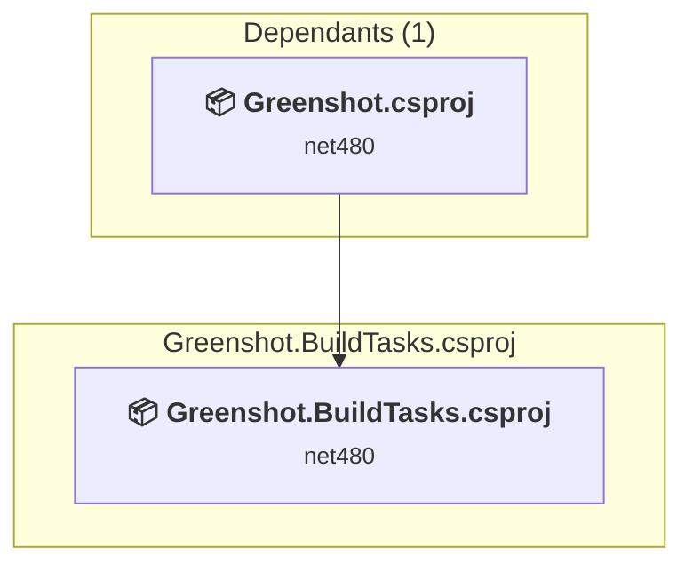

### API Compatibility

| Category | Count | Impact |
| :--- | :---: | :--- |
| 🔴 Binary Incompatible | 0 | High - Require code changes |
| 🟡 Source Incompatible | 0 | Medium - Needs re-compilation and potential conflicting API error fixing |
| 🔵 Behavioral change | 1 | Low - Behavioral changes that may require testing at runtime |
| ✅ Compatible | 187 |  |
| ***Total APIs Analyzed*** | ***188*** |  |

### Greenshot.Editor\Greenshot.Editor.csproj

#### Project Info

- **Current Target Framework:** net480
- **Proposed Target Framework:** net10.0-windows
- **SDK-style**: True
- **Project Kind:** Wpf
- **Dependencies**: 1
- **Dependants**: 2
- **Number of Files**: 172
- **Number of Files with Incidents**: 91
- **Lines of Code**: 28756
- **Estimated LOC to modify**: 8465+ (at least 29,4% of the project)

#### Dependency Graph

Legend:
📦 SDK-style project
⚙️ Classic project

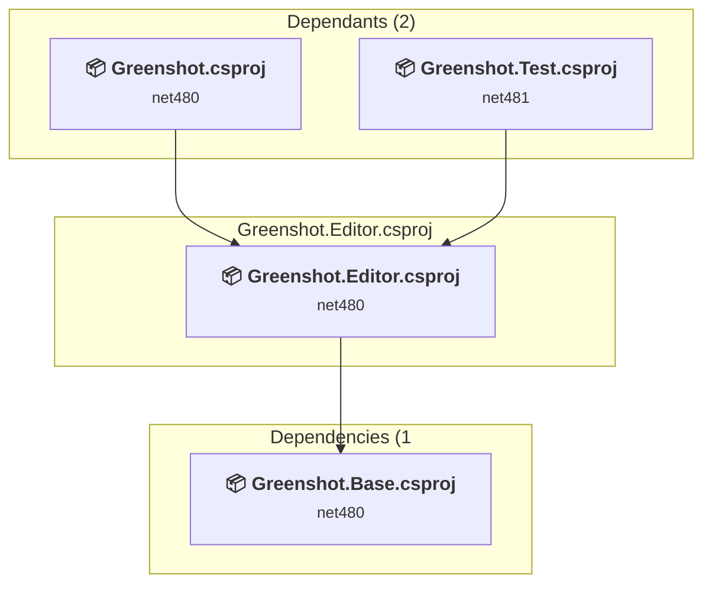

### API Compatibility

| Category | Count | Impact |
| :--- | :---: | :--- |
| 🔴 Binary Incompatible | 6203 | High - Require code changes |
| 🟡 Source Incompatible | 2249 | Medium - Needs re-compilation and potential conflicting API error fixing |
| 🔵 Behavioral change | 13 | Low - Behavioral changes that may require testing at runtime |
| ✅ Compatible | 17282 |  |
| ***Total APIs Analyzed*** | ***25747*** |  |

#### Project Technologies and Features

| Technology | Issues | Percentage | Migration Path |
| :--- | :---: | :---: | :--- |
| Windows Forms Legacy Controls | 4 | 0,0% | Legacy Windows Forms controls that have been removed from .NET Core/5+ including StatusBar, DataGrid, ContextMenu, MainMenu, MenuItem, and ToolBar. These controls were replaced by more modern alternatives. Use ToolStrip, MenuStrip, ContextMenuStrip, and DataGridView instead. |
| Deprecated Remoting & Serialization | 1 | 0,0% | Legacy .NET Remoting, BinaryFormatter, and related serialization APIs that are deprecated and removed for security reasons. Remoting provided distributed object communication but had significant security vulnerabilities. Migrate to gRPC, HTTP APIs, or modern serialization (System.Text.Json, protobuf). |
| WPF (Windows Presentation Foundation) | 72 | 0,9% | WPF APIs for building Windows desktop applications with XAML-based UI that are available in .NET on Windows. WPF provides rich desktop UI capabilities with data binding and styling. Enable Windows Desktop support: Option 1 (Recommended): Target net9.0-windows; Option 2: Add <UseWindowsDesktop>true</UseWindowsDesktop>. |
| Windows Forms | 6083 | 71,9% | Windows Forms APIs for building Windows desktop applications with traditional Forms-based UI that are available in .NET on Windows. Enable Windows Desktop support: Option 1 (Recommended): Target net9.0-windows; Option 2: Add <UseWindowsDesktop>true</UseWindowsDesktop>; Option 3 (Legacy): Use Microsoft.NET.Sdk.WindowsDesktop SDK. |
| GDI+ / System.Drawing | 2235 | 26,4% | System.Drawing APIs for 2D graphics, imaging, and printing that are available via NuGet package System.Drawing.Common. Note: Not recommended for server scenarios due to Windows dependencies; consider cross-platform alternatives like SkiaSharp or ImageSharp for new code. |

### Greenshot.Plugin.Box\Greenshot.Plugin.Box.csproj

#### Project Info

- **Current Target Framework:** net480
- **Proposed Target Framework:** net10.0-windows
- **SDK-style**: True
- **Project Kind:** Wpf
- **Dependencies**: 1
- **Dependants**: 0
- **Number of Files**: 13
- **Number of Files with Incidents**: 6
- **Lines of Code**: 826
- **Estimated LOC to modify**: 156+ (at least 18,9% of the project)

#### Dependency Graph

Legend:
📦 SDK-style project
⚙️ Classic project

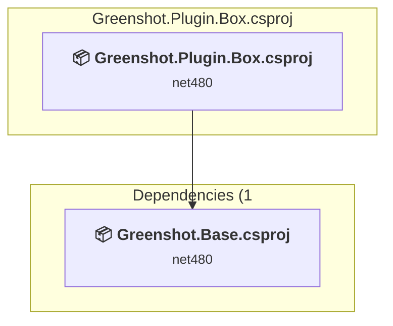

### API Compatibility

| Category | Count | Impact |
| :--- | :---: | :--- |
| 🔴 Binary Incompatible | 153 | High - Require code changes |
| 🟡 Source Incompatible | 3 | Medium - Needs re-compilation and potential conflicting API error fixing |
| 🔵 Behavioral change | 0 | Low - Behavioral changes that may require testing at runtime |
| ✅ Compatible | 386 |  |
| ***Total APIs Analyzed*** | ***542*** |  |

#### Project Technologies and Features

| Technology | Issues | Percentage | Migration Path |
| :--- | :---: | :---: | :--- |
| GDI+ / System.Drawing | 3 | 1,9% | System.Drawing APIs for 2D graphics, imaging, and printing that are available via NuGet package System.Drawing.Common. Note: Not recommended for server scenarios due to Windows dependencies; consider cross-platform alternatives like SkiaSharp or ImageSharp for new code. |
| Windows Forms | 153 | 98,1% | Windows Forms APIs for building Windows desktop applications with traditional Forms-based UI that are available in .NET on Windows. Enable Windows Desktop support: Option 1 (Recommended): Target net9.0-windows; Option 2: Add <UseWindowsDesktop>true</UseWindowsDesktop>; Option 3 (Legacy): Use Microsoft.NET.Sdk.WindowsDesktop SDK. |

### Greenshot.Plugin.Confluence\Greenshot.Plugin.Confluence.csproj

#### Project Info

- **Current Target Framework:** net480
- **Proposed Target Framework:** net10.0-windows
- **SDK-style**: True
- **Project Kind:** Wpf
- **Dependencies**: 1
- **Dependants**: 0
- **Number of Files**: 21
- **Number of Files with Incidents**: 20
- **Lines of Code**: 2189
- **Estimated LOC to modify**: 374+ (at least 17,1% of the project)

#### Dependency Graph

Legend:
📦 SDK-style project
⚙️ Classic project

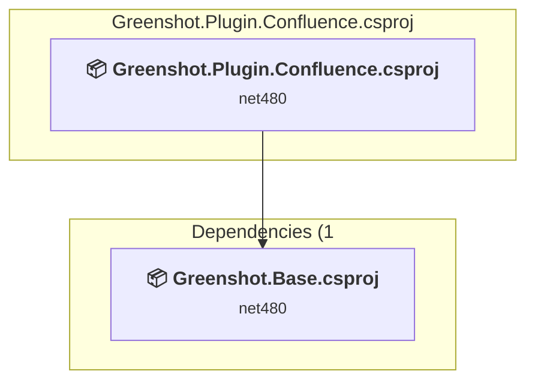

### API Compatibility

| Category | Count | Impact |
| :--- | :---: | :--- |
| 🔴 Binary Incompatible | 349 | High - Require code changes |
| 🟡 Source Incompatible | 8 | Medium - Needs re-compilation and potential conflicting API error fixing |
| 🔵 Behavioral change | 17 | Low - Behavioral changes that may require testing at runtime |
| ✅ Compatible | 1433 |  |
| ***Total APIs Analyzed*** | ***1807*** |  |

#### Project Technologies and Features

| Technology | Issues | Percentage | Migration Path |
| :--- | :---: | :---: | :--- |
| GDI+ / System.Drawing | 8 | 2,1% | System.Drawing APIs for 2D graphics, imaging, and printing that are available via NuGet package System.Drawing.Common. Note: Not recommended for server scenarios due to Windows dependencies; consider cross-platform alternatives like SkiaSharp or ImageSharp for new code. |
| WPF (Windows Presentation Foundation) | 230 | 61,5% | WPF APIs for building Windows desktop applications with XAML-based UI that are available in .NET on Windows. WPF provides rich desktop UI capabilities with data binding and styling. Enable Windows Desktop support: Option 1 (Recommended): Target net9.0-windows; Option 2: Add <UseWindowsDesktop>true</UseWindowsDesktop>. |
| Windows Forms | 4 | 1,1% | Windows Forms APIs for building Windows desktop applications with traditional Forms-based UI that are available in .NET on Windows. Enable Windows Desktop support: Option 1 (Recommended): Target net9.0-windows; Option 2: Add <UseWindowsDesktop>true</UseWindowsDesktop>; Option 3 (Legacy): Use Microsoft.NET.Sdk.WindowsDesktop SDK. |

### Greenshot.Plugin.Dropbox\Greenshot.Plugin.Dropbox.csproj

#### Project Info

- **Current Target Framework:** net480
- **Proposed Target Framework:** net10.0-windows
- **SDK-style**: True
- **Project Kind:** Wpf
- **Dependencies**: 1
- **Dependants**: 0
- **Number of Files**: 12
- **Number of Files with Incidents**: 6
- **Lines of Code**: 716
- **Estimated LOC to modify**: 140+ (at least 19,6% of the project)

#### Dependency Graph

Legend:
📦 SDK-style project
⚙️ Classic project

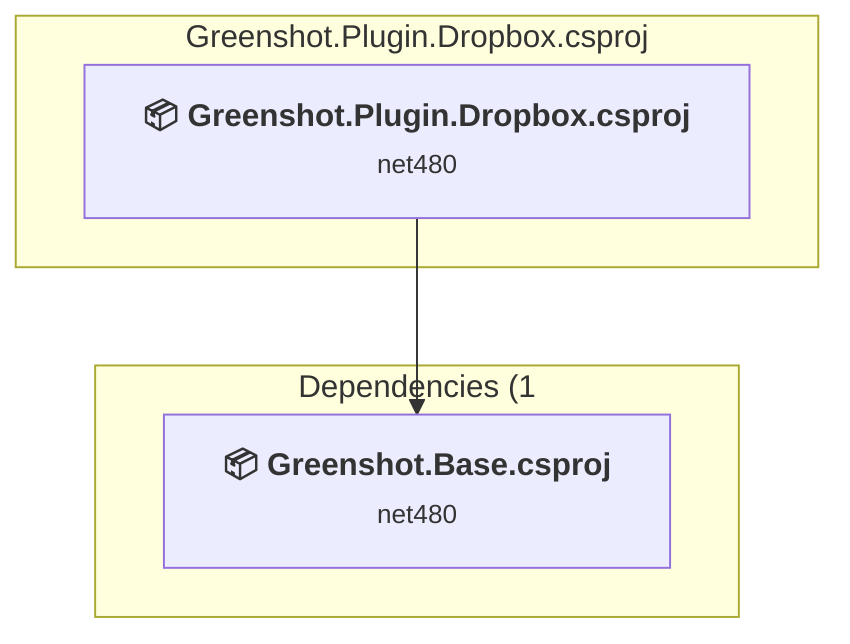

### API Compatibility

| Category | Count | Impact |
| :--- | :---: | :--- |
| 🔴 Binary Incompatible | 137 | High - Require code changes |
| 🟡 Source Incompatible | 3 | Medium - Needs re-compilation and potential conflicting API error fixing |
| 🔵 Behavioral change | 0 | Low - Behavioral changes that may require testing at runtime |
| ✅ Compatible | 292 |  |
| ***Total APIs Analyzed*** | ***432*** |  |

#### Project Technologies and Features

| Technology | Issues | Percentage | Migration Path |
| :--- | :---: | :---: | :--- |
| GDI+ / System.Drawing | 3 | 2,1% | System.Drawing APIs for 2D graphics, imaging, and printing that are available via NuGet package System.Drawing.Common. Note: Not recommended for server scenarios due to Windows dependencies; consider cross-platform alternatives like SkiaSharp or ImageSharp for new code. |
| Windows Forms | 137 | 97,9% | Windows Forms APIs for building Windows desktop applications with traditional Forms-based UI that are available in .NET on Windows. Enable Windows Desktop support: Option 1 (Recommended): Target net9.0-windows; Option 2: Add <UseWindowsDesktop>true</UseWindowsDesktop>; Option 3 (Legacy): Use Microsoft.NET.Sdk.WindowsDesktop SDK. |

### Greenshot.Plugin.ExternalCommand\Greenshot.Plugin.ExternalCommand.csproj

#### Project Info

- **Current Target Framework:** net480
- **Proposed Target Framework:** net10.0-windows
- **SDK-style**: True
- **Project Kind:** Wpf
- **Dependencies**: 1
- **Dependants**: 0
- **Number of Files**: 10
- **Number of Files with Incidents**: 8
- **Lines of Code**: 1592
- **Estimated LOC to modify**: 507+ (at least 31,8% of the project)

#### Dependency Graph

Legend:
📦 SDK-style project
⚙️ Classic project

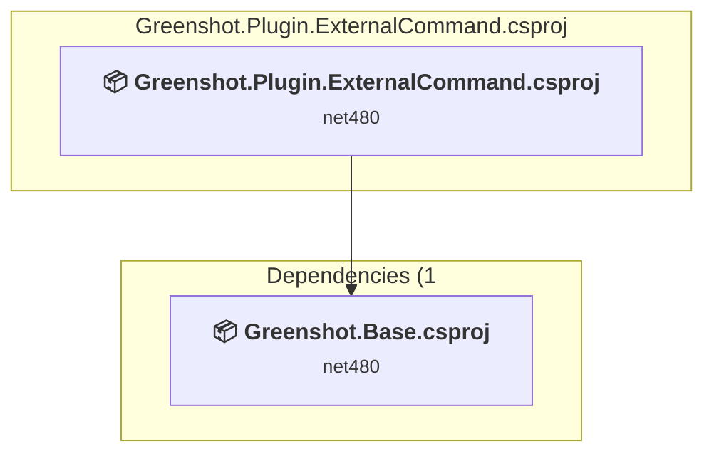

### API Compatibility

| Category | Count | Impact |
| :--- | :---: | :--- |
| 🔴 Binary Incompatible | 496 | High - Require code changes |
| 🟡 Source Incompatible | 11 | Medium - Needs re-compilation and potential conflicting API error fixing |
| 🔵 Behavioral change | 0 | Low - Behavioral changes that may require testing at runtime |
| ✅ Compatible | 1217 |  |
| ***Total APIs Analyzed*** | ***1724*** |  |

#### Project Technologies and Features

| Technology | Issues | Percentage | Migration Path |
| :--- | :---: | :---: | :--- |
| Windows Forms | 496 | 97,8% | Windows Forms APIs for building Windows desktop applications with traditional Forms-based UI that are available in .NET on Windows. Enable Windows Desktop support: Option 1 (Recommended): Target net9.0-windows; Option 2: Add <UseWindowsDesktop>true</UseWindowsDesktop>; Option 3 (Legacy): Use Microsoft.NET.Sdk.WindowsDesktop SDK. |
| GDI+ / System.Drawing | 11 | 2,2% | System.Drawing APIs for 2D graphics, imaging, and printing that are available via NuGet package System.Drawing.Common. Note: Not recommended for server scenarios due to Windows dependencies; consider cross-platform alternatives like SkiaSharp or ImageSharp for new code. |

### Greenshot.Plugin.Imgur\Greenshot.Plugin.Imgur.csproj

#### Project Info

- **Current Target Framework:** net480
- **Proposed Target Framework:** net10.0-windows
- **SDK-style**: True
- **Project Kind:** Wpf
- **Dependencies**: 1
- **Dependants**: 0
- **Number of Files**: 13
- **Number of Files with Incidents**: 9
- **Lines of Code**: 1427
- **Estimated LOC to modify**: 647+ (at least 45,3% of the project)

#### Dependency Graph

Legend:
📦 SDK-style project
⚙️ Classic project

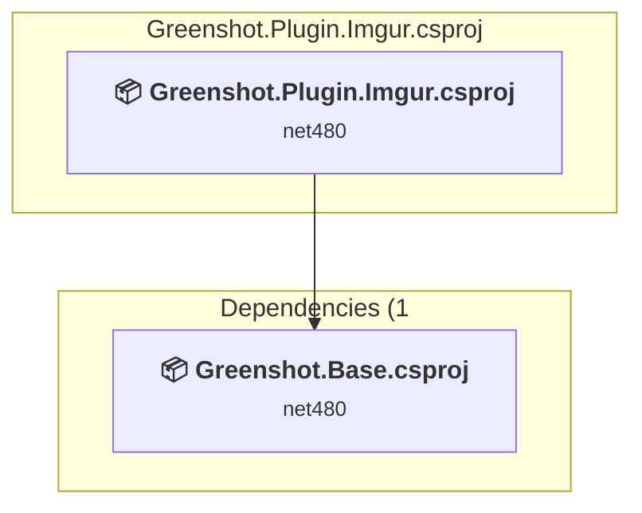

### API Compatibility

| Category | Count | Impact |
| :--- | :---: | :--- |
| 🔴 Binary Incompatible | 621 | High - Require code changes |
| 🟡 Source Incompatible | 26 | Medium - Needs re-compilation and potential conflicting API error fixing |
| 🔵 Behavioral change | 0 | Low - Behavioral changes that may require testing at runtime |
| ✅ Compatible | 823 |  |
| ***Total APIs Analyzed*** | ***1470*** |  |

#### Project Technologies and Features

| Technology | Issues | Percentage | Migration Path |
| :--- | :---: | :---: | :--- |
| GDI+ / System.Drawing | 26 | 4,0% | System.Drawing APIs for 2D graphics, imaging, and printing that are available via NuGet package System.Drawing.Common. Note: Not recommended for server scenarios due to Windows dependencies; consider cross-platform alternatives like SkiaSharp or ImageSharp for new code. |
| Windows Forms | 621 | 96,0% | Windows Forms APIs for building Windows desktop applications with traditional Forms-based UI that are available in .NET on Windows. Enable Windows Desktop support: Option 1 (Recommended): Target net9.0-windows; Option 2: Add <UseWindowsDesktop>true</UseWindowsDesktop>; Option 3 (Legacy): Use Microsoft.NET.Sdk.WindowsDesktop SDK. |

### Greenshot.Plugin.Jira\Greenshot.Plugin.Jira.csproj

#### Project Info

- **Current Target Framework:** net480
- **Proposed Target Framework:** net10.0-windows
- **SDK-style**: True
- **Project Kind:** Wpf
- **Dependencies**: 1
- **Dependants**: 0
- **Number of Files**: 19
- **Number of Files with Incidents**: 10
- **Lines of Code**: 2220
- **Estimated LOC to modify**: 772+ (at least 34,8% of the project)

#### Dependency Graph

Legend:
📦 SDK-style project
⚙️ Classic project

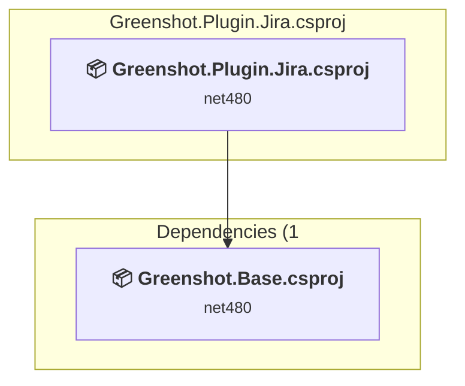

### API Compatibility

| Category | Count | Impact |
| :--- | :---: | :--- |
| 🔴 Binary Incompatible | 707 | High - Require code changes |
| 🟡 Source Incompatible | 51 | Medium - Needs re-compilation and potential conflicting API error fixing |
| 🔵 Behavioral change | 14 | Low - Behavioral changes that may require testing at runtime |
| ✅ Compatible | 1507 |  |
| ***Total APIs Analyzed*** | ***2279*** |  |

#### Project Technologies and Features

| Technology | Issues | Percentage | Migration Path |
| :--- | :---: | :---: | :--- |
| Windows Forms | 707 | 91,6% | Windows Forms APIs for building Windows desktop applications with traditional Forms-based UI that are available in .NET on Windows. Enable Windows Desktop support: Option 1 (Recommended): Target net9.0-windows; Option 2: Add <UseWindowsDesktop>true</UseWindowsDesktop>; Option 3 (Legacy): Use Microsoft.NET.Sdk.WindowsDesktop SDK. |
| GDI+ / System.Drawing | 14 | 1,8% | System.Drawing APIs for 2D graphics, imaging, and printing that are available via NuGet package System.Drawing.Common. Note: Not recommended for server scenarios due to Windows dependencies; consider cross-platform alternatives like SkiaSharp or ImageSharp for new code. |

### Greenshot.Plugin.Office\Greenshot.Plugin.Office.csproj

#### Project Info

- **Current Target Framework:** net480
- **Proposed Target Framework:** net10.0-windows
- **SDK-style**: True
- **Project Kind:** Wpf
- **Dependencies**: 1
- **Dependants**: 0
- **Number of Files**: 25
- **Number of Files with Incidents**: 7
- **Lines of Code**: 3724
- **Estimated LOC to modify**: 37+ (at least 1,0% of the project)

#### Dependency Graph

Legend:
📦 SDK-style project
⚙️ Classic project

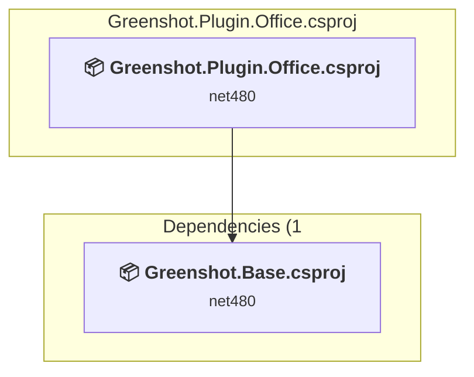

### API Compatibility

| Category | Count | Impact |
| :--- | :---: | :--- |
| 🔴 Binary Incompatible | 8 | High - Require code changes |
| 🟡 Source Incompatible | 29 | Medium - Needs re-compilation and potential conflicting API error fixing |
| 🔵 Behavioral change | 0 | Low - Behavioral changes that may require testing at runtime |
| ✅ Compatible | 2226 |  |
| ***Total APIs Analyzed*** | ***2263*** |  |

#### Project Technologies and Features

| Technology | Issues | Percentage | Migration Path |
| :--- | :---: | :---: | :--- |
| Windows Forms | 8 | 21,6% | Windows Forms APIs for building Windows desktop applications with traditional Forms-based UI that are available in .NET on Windows. Enable Windows Desktop support: Option 1 (Recommended): Target net9.0-windows; Option 2: Add <UseWindowsDesktop>true</UseWindowsDesktop>; Option 3 (Legacy): Use Microsoft.NET.Sdk.WindowsDesktop SDK. |
| GDI+ / System.Drawing | 29 | 78,4% | System.Drawing APIs for 2D graphics, imaging, and printing that are available via NuGet package System.Drawing.Common. Note: Not recommended for server scenarios due to Windows dependencies; consider cross-platform alternatives like SkiaSharp or ImageSharp for new code. |

### Greenshot.Test\Greenshot.Test.csproj

#### Project Info

- **Current Target Framework:** net481
- **Proposed Target Framework:** net10.0-windows
- **SDK-style**: True
- **Project Kind:** Wpf
- **Dependencies**: 1
- **Dependants**: 0
- **Number of Files**: 69
- **Number of Files with Incidents**: 34
- **Lines of Code**: 9442
- **Estimated LOC to modify**: 448+ (at least 4,7% of the project)

#### Dependency Graph

Legend:
📦 SDK-style project
⚙️ Classic project

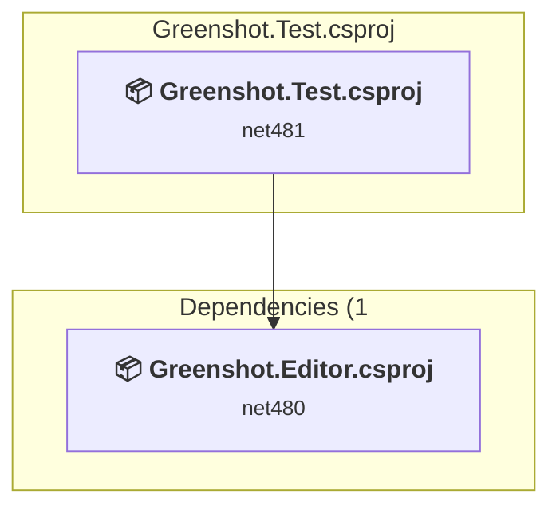

### API Compatibility

| Category | Count | Impact |
| :--- | :---: | :--- |
| 🔴 Binary Incompatible | 0 | High - Require code changes |
| 🟡 Source Incompatible | 448 | Medium - Needs re-compilation and potential conflicting API error fixing |
| 🔵 Behavioral change | 0 | Low - Behavioral changes that may require testing at runtime |
| ✅ Compatible | 11893 |  |
| ***Total APIs Analyzed*** | ***12341*** |  |

#### Project Technologies and Features

| Technology | Issues | Percentage | Migration Path |
| :--- | :---: | :---: | :--- |
| Deprecated Remoting & Serialization | 1 | 0,2% | Legacy .NET Remoting, BinaryFormatter, and related serialization APIs that are deprecated and removed for security reasons. Remoting provided distributed object communication but had significant security vulnerabilities. Migrate to gRPC, HTTP APIs, or modern serialization (System.Text.Json, protobuf). |
| GDI+ / System.Drawing | 447 | 99,8% | System.Drawing APIs for 2D graphics, imaging, and printing that are available via NuGet package System.Drawing.Common. Note: Not recommended for server scenarios due to Windows dependencies; consider cross-platform alternatives like SkiaSharp or ImageSharp for new code. |

### Greenshot\Greenshot.csproj

#### Project Info

- **Current Target Framework:** net480
- **Proposed Target Framework:** net10.0-windows
- **SDK-style**: True
- **Project Kind:** Wpf
- **Dependencies**: 3
- **Dependants**: 0
- **Number of Files**: 72
- **Number of Files with Incidents**: 40
- **Lines of Code**: 14591
- **Estimated LOC to modify**: 4276+ (at least 29,3% of the project)

#### Dependency Graph

Legend:
📦 SDK-style project
⚙️ Classic project

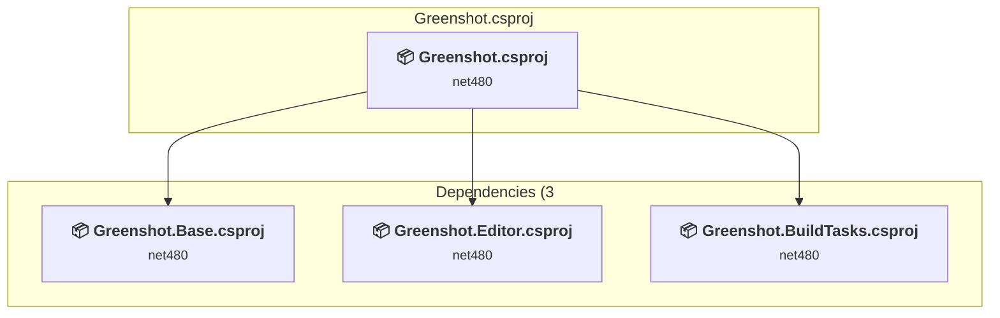

### API Compatibility

| Category | Count | Impact |
| :--- | :---: | :--- |
| 🔴 Binary Incompatible | 3396 | High - Require code changes |
| 🟡 Source Incompatible | 869 | Medium - Needs re-compilation and potential conflicting API error fixing |
| 🔵 Behavioral change | 11 | Low - Behavioral changes that may require testing at runtime |
| ✅ Compatible | 9282 |  |
| ***Total APIs Analyzed*** | ***13558*** |  |

#### Project Technologies and Features

| Technology | Issues | Percentage | Migration Path |
| :--- | :---: | :---: | :--- |
| COM Interop Changes | 4 | 0,1% | COM-specific APIs that have changes or removals in .NET Core/.NET due to cross-platform considerations. Some COM interop functionality requires Windows-specific features. Review COM interop requirements; some APIs require Windows Compatibility Pack. |
| Code Access Security (CAS) | 2 | 0,0% | Code Access Security (CAS) APIs that were removed in .NET Core/.NET for security and performance reasons. CAS provided fine-grained security policies but proved complex and ineffective. Remove CAS usage; not supported in modern .NET. |
| Windows Forms Legacy Controls | 1 | 0,0% | Legacy Windows Forms controls that have been removed from .NET Core/5+ including StatusBar, DataGrid, ContextMenu, MainMenu, MenuItem, and ToolBar. These controls were replaced by more modern alternatives. Use ToolStrip, MenuStrip, ContextMenuStrip, and DataGridView instead. |
| Windows Access Control Lists (ACLs) | 1 | 0,0% | Windows Access Control List (ACL) APIs for file, directory, and synchronization object security that have moved to extension methods or different types. While .NET Core supports Windows ACLs, the APIs have been reorganized. Use System.IO.FileSystem.AccessControl and similar packages for ACL functionality. |
| GDI+ / System.Drawing | 798 | 18,7% | System.Drawing APIs for 2D graphics, imaging, and printing that are available via NuGet package System.Drawing.Common. Note: Not recommended for server scenarios due to Windows dependencies; consider cross-platform alternatives like SkiaSharp or ImageSharp for new code. |
| Windows Forms | 3392 | 79,3% | Windows Forms APIs for building Windows desktop applications with traditional Forms-based UI that are available in .NET on Windows. Enable Windows Desktop support: Option 1 (Recommended): Target net9.0-windows; Option 2: Add <UseWindowsDesktop>true</UseWindowsDesktop>; Option 3 (Legacy): Use Microsoft.NET.Sdk.WindowsDesktop SDK. |

